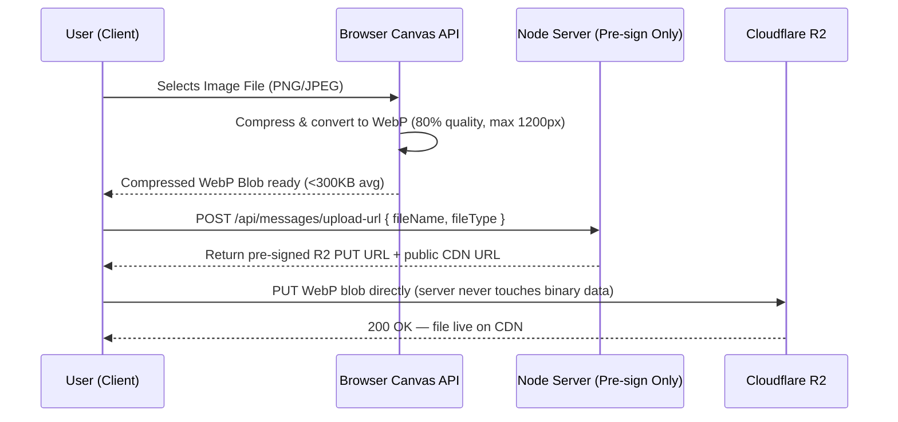
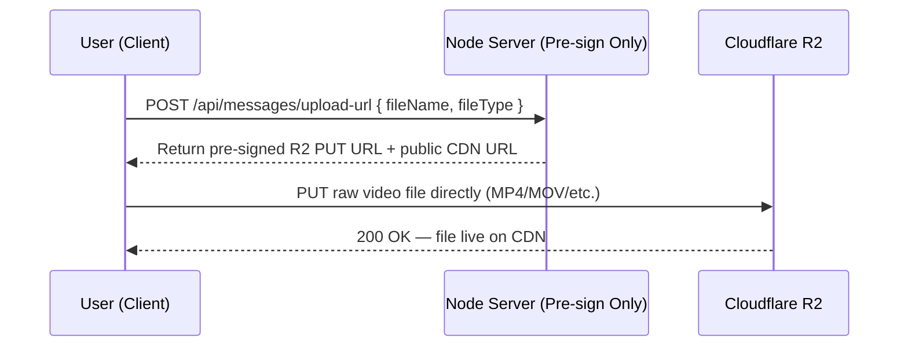

# 🖼️ Client-Side Unified Media Engine: WebP Compression & Cloudflare R2 Direct Upload

This document outlines the architecture, client-side image compression, Cloudflare R2 direct upload pipeline, and lazy-loading flows designed to deliver near-instant file sharing while maintaining 100% server bandwidth and CPU efficiency.

> **📌 Source of Truth**: The authoritative video upload strategy is defined in `master_system_blueprint.md §7.2`. Videos are uploaded **directly to Cloudflare R2 as-is** via pre-signed URLs. No client-side video transcoding (FFmpeg.wasm) is used anywhere in this project.

---

## 📊 1. Architectural Strategy: Client-Side vs. Server-Side

| Metric | Server-Side Processing (Multer + Sharp) | Client-Side Processing (Canvas API + R2 Direct Upload) | Winner & Rationale |
| :--- | :--- | :--- | :--- |
| **Network Bandwidth** | ❌ **High Waste**: User uploads raw massive files (e.g., 15MB PNG). Upload times are extremely slow on weak connections. | 🏆 **High Savings**: Images are compressed locally via Canvas before upload. Videos go directly to R2 via pre-signed URL, bypassing the server. | **Client-Side**: Eliminates heavy image uploads; videos bypass the Node.js server entirely. |
| **Server CPU Load** | ❌ **High/Spiky**: Processing images on the server spikes host CPU, freezing the chat socket server. Free tiers will crash or auto-suspend. | 🏆 **0% Overhead**: The server performs no file conversions whatsoever. It only issues a short-lived pre-signed R2 URL. | **Client-Side**: Keeps the backend lightweight, highly scalable, and cheap to host. |
| **Initial Bundle Size** | 🏆 **0KB Added**: All processing libraries live on the server. | 🏆 **0KB Added**: Canvas API is browser-native. No WebAssembly binaries are loaded. | **Tied**: Both approaches add zero bundle weight. |
| **Processing Speed** | 🏆 **Highly Predictable**: Fixed virtual core CPU environment. | ⚡ **Near-instant**: Canvas WebP conversion completes in <50ms across all devices. | **Client-Side Canvas**: Image conversion is instant and reliable on any modern device. |

---

## 🔄 2. The Upload Flows

### 🖼️ Image Upload Flow (Canvas → WebP → R2)



### 🎥 Video Upload Flow (Direct R2 — No Transcoding)



> **Why no client-side video transcoding?** Adding FFmpeg.wasm would introduce a ~30MB WebAssembly binary, a slow initialization step, and device-dependent encoding times. Since R2 serves files globally via Cloudflare's CDN and modern browsers natively play MP4/WebM, transcoding is unnecessary overhead for this MVP.

---

## 🛠️ 3. Client-Side Implementation

### 🖼️ A. Dynamic Image WebP Compressor (Native Canvas API)
Uses 0% bundle size. Leverages the browser-native Canvas rendering engine to scale and compress any standard format to a lightweight `.webp` in milliseconds.

```javascript
/**
 * Compresses any image file client-side to modern WebP format
 * @param {File} file - Raw uploaded file (PNG, JPEG, etc.)
 * @param {number} maxWidth - Maximum bounding width for scaling
 * @returns {Promise<File>} Compressed WebP file
 */
export const compressImageToWebP = (file, maxWidth = 1200) => {
  return new Promise((resolve, reject) => {
    const img = new Image();
    img.src = URL.createObjectURL(file);

    img.onload = () => {
      const canvas = document.createElement("canvas");
      // Rescale only if original width exceeds max width
      canvas.width = Math.min(img.width, maxWidth);
      canvas.height = (canvas.width / img.width) * img.height;

      const ctx = canvas.getContext("2d");
      ctx.drawImage(img, 0, 0, canvas.width, canvas.height);

      canvas.toBlob((blob) => {
        if (!blob) {
          reject(new Error("Canvas conversion to Blob failed"));
          return;
        }
        const compressedFile = new File([blob], `img-${Date.now()}.webp`, {
          type: "image/webp"
        });
        resolve(compressedFile);
      }, "image/webp", 0.8); // 80% compression quality sweet-spot
    };

    img.onerror = (err) => reject(err);
  });
};
```

### ☁️ B. Cloudflare R2 Direct Upload (Pre-Signed URL)
After compressing images (or without modification for videos), the client requests a pre-signed URL from the backend and uploads the file straight to R2. The Node.js server **never handles the binary payload**.

```javascript
/**
 * Uploads a file directly to Cloudflare R2 via a pre-signed URL
 * @param {File} file - The file to upload (compressed WebP or raw video)
 * @returns {Promise<string>} The permanent public CDN URL
 */
export const uploadToR2 = async (file) => {
  // Step 1: Request a pre-signed PUT URL from our backend
  const { data } = await axios.post("/api/messages/upload-url", {
    fileName: file.name,
    fileType: file.type
  });

  // Step 2: PUT file directly to R2 — the Node.js server is NOT involved
  await fetch(data.signedUrl, {
    method: "PUT",
    headers: { "Content-Type": file.type },
    body: file
  });

  // Step 3: Return the permanent public CDN URL for saving in MongoDB
  return data.publicUrl;
};
```

---

## 🔌 4. Server-Side Pre-Sign Endpoint

The server's **only role** in the file upload lifecycle is generating a short-lived pre-signed URL. It performs zero file reading, writing, or processing. All heavy lifting happens at the edge (Cloudflare R2).

```javascript
const { S3Client, PutObjectCommand } = require("@aws-sdk/client-s3");
const { getSignedUrl } = require("@aws-sdk/s3-request-presigner");

const r2 = new S3Client({
  region: "auto",
  endpoint: process.env.R2_ENDPOINT,
  credentials: {
    accessKeyId: process.env.R2_ACCESS_KEY_ID,
    secretAccessKey: process.env.R2_SECRET_ACCESS_KEY
  }
});

/**
 * @route   POST /api/messages/upload-url
 * @desc    Issue a Cloudflare R2 pre-signed PUT URL for direct client upload
 * @access  Private (JWT Protected)
 */
router.post("/api/messages/upload-url", protect, async (req, res) => {
  const { fileName, fileType } = req.body;
  const key = `uploads/${Date.now()}-${fileName}`;

  const command = new PutObjectCommand({
    Bucket: process.env.R2_BUCKET_NAME,
    Key: key,
    ContentType: fileType
  });

  // URL expires in 5 minutes — sufficient for any reasonable upload
  const signedUrl = await getSignedUrl(r2, command, { expiresIn: 300 });

  res.json({
    signedUrl,
    publicUrl: `${process.env.R2_PUBLIC_URL}/${key}`
  });
});
```

---

## 🎁 5. Interactive Features Matrix

| Feature | Input Mode | Storage Cost | Compression Standard | Dynamic Polish |
| :--- | :--- | :--- | :--- | :--- |
| **GIPHY Picker** | Search box queries Proxy endpoint | **0 bytes** (URL string saved only) | Native Giphy hosted URL | Animated Hover Previews |
| **Emoji Keyboard** | Text Insertion modal | **0 bytes** (Standard Unicode character) | UTF-8 unicode bytes | Bouncing Reaction Badges |
| **Image Upload** | Drag & Drop / File Selector | **Minimal** (Avg. 250KB WebP) | Browser Canvas WebP (80%, max 1200px) | Glow Border Dropzone |
| **Video Upload** | Drag & Drop / File Selector | **Varies** (Raw file, no transcoding) | Direct R2 Upload — native browser playback | Upload Progress Bar |
