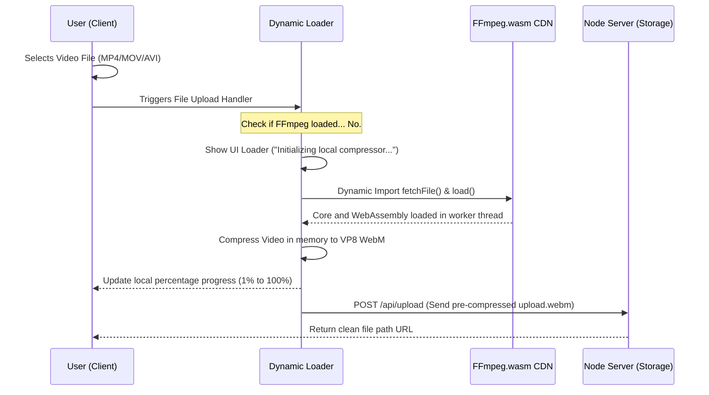

# 🖼️ Client-Side Unified Media Engine: Performance-Optimized WebP & WebM Converter

This document outlines the architecture, client-side dynamic compression libraries, lazy-loading flows, and server-side receiving endpoints designed to deliver near-instant file sharing while maintaining 100% server bandwidth and CPU efficiency.

---

## 📊 1. Architectural Strategy: Client-Side vs. Server-Side

| Metric | Server-Side Processing (Multer + Sharp + FFmpeg) | Client-Side Processing (Canvas API + FFmpeg.wasm) | Winner & Rationale |
| :--- | :--- | :--- | :--- |
| **Network Bandwidth** | ❌ **High Waste**: User uploads raw massive files (e.g., 15MB PNG, 50MB MP4). Upload times are extremely slow on weak connections. | 🏆 **95% Savings**: The client compresses media locally down to ~300KB *before* sending it over the network. | **Client-Side**: Eliminates heavy data uploads entirely, delivering a hyper-responsive experience. |
| **Server CPU Load** | ❌ **High/Spiky**: Encoding MP4 to WebM spikes host CPU to 100%, freezing the chat socket server. Free tiers will crash or auto-suspend. | 🏆 **0% Overhead**: The server performs no conversions; it only saves pre-compressed static files to disk. | **Client-Side**: Keeps the backend lightweight, highly scalable, and cheap to host. |
| **Initial Bundle Size** | 🏆 **0KB Added**: All processing libraries live on the server. | ❌ **Heavy (~30MB)**: WebAssembly binaries must load in the user's browser, slowing initial site load. | **Hybrid/Lazy-Loaded**: Solve client bloat by **lazy-loading** the video converter only when a user selects a video. |
| **Processing Speed** | 🏆 **Highly Predictable**: Fixed virtual core CPU environment. | ⚡ **Device-Dependent**: Fast on desktop; slower on low-end mobile. | **Client-Side Canvas**: Image conversion is instant (<50ms) across all devices. |

---

## 🔄 2. The Dynamic Lazy-Loading Flow

To keep the application initial bundle extremely light, the client uses **on-demand dependency loading**. Emojis and Canvas converters are instantly available, while FFmpeg.wasm loads only when a video upload is initiated.



---

## 🛠️ 3. Client-Side Implementation Code

### 🖼️ A. Dynamic Image WebP Compressor (Native Canvas API)
Uses 0% bundle size. Leverages browser-native Canvas rendering engine to scale and compress any standard format to a lightweight `.webp` in milliseconds.

```javascript
/**
 * Compresses any image file client-side to modern WebP format
 * @param {File} file - Raw uploaded file (PNG, JPEG, etc.)
 * @param {number} maxWidth - Maximum bounding width for scaling
 * @returns {Promise<File>} Compressed WebP file
 */
export const compressImageToWebP = (file, maxWidth = 1200) => {
  return new Promise((resolve, reject) => {
    const img = new Image();
    img.src = URL.createObjectURL(file);
    
    img.onload = () => {
      const canvas = document.createElement("canvas");
      // Rescale only if original width exceeds max width
      canvas.width = Math.min(img.width, maxWidth);
      canvas.height = (canvas.width / img.width) * img.height;

      const ctx = canvas.getContext("2d");
      ctx.drawImage(img, 0, 0, canvas.width, canvas.height);

      canvas.toBlob((blob) => {
        if (!blob) {
          reject(new Error("Canvas conversion to Blob failed"));
          return;
        }
        const compressedFile = new File([blob], `img-${Date.now()}.webp`, {
          type: "image/webp"
        });
        resolve(compressedFile);
      }, "image/webp", 0.8); // 80% compression quality sweet-spot
    };

    img.onerror = (err) => reject(err);
  });
};
```

### 🎥 B. Dynamic Video Transcoder (FFmpeg.wasm Web Worker)
Dynamically imports WebAssembly binaries from a trusted CDN on-demand, running the VP8 encoding inside a separate CPU thread to keep the page completely active.

```javascript
let ffmpegInstance = null;

/**
 * Lazy-loads WebAssembly FFmpeg.wasm packages
 */
const loadFFmpegWasm = async () => {
  if (ffmpegInstance) return ffmpegInstance;

  // Import libraries dynamically from CDN
  const { createFFmpeg } = await import("@ffmpeg/ffmpeg");
  
  const ffmpeg = createFFmpeg({
    log: true,
    corePath: "https://unpkg.com/@ffmpeg/core@0.11.0/dist/ffmpeg-core.js"
  });

  await ffmpeg.load();
  ffmpegInstance = ffmpeg;
  return ffmpeg;
};

/**
 * Dynamically transcodes video files into lightweight WebM locally
 * @param {File} videoFile - Source video file (MP4, MOV, etc.)
 * @param {Function} onProgress - Callback receiving numeric percentage (0 - 100)
 */
export const transcodeVideoToWebM = async (videoFile, onProgress) => {
  const { fetchFile } = await import("@ffmpeg/ffmpeg");
  const ffmpeg = await loadFFmpegWasm();
  
  const inputName = `input-${Date.now()}`;
  const outputName = `output-${Date.now()}.webm`;

  // Write file to internal Wasm virtual sandbox
  ffmpeg.FS("writeFile", inputName, await fetchFile(videoFile));

  // Hook transcoding progress events
  ffmpeg.setProgress(({ ratio }) => {
    if (onProgress) onProgress(Math.round(ratio * 100));
  });

  // Run the libvpx VP8 transcoder command
  await ffmpeg.run(
    "-i", inputName,
    "-vcodec", "libvpx",
    "-acodec", "libvorbis",
    "-b:v", "1200k", // Ideal standard streaming bitrate
    outputName
  );

  // Read back processed bytes
  const data = ffmpeg.FS("readFile", outputName);
  
  // Free internal WebAssembly sandbox memory
  ffmpeg.FS("unlink", inputName);
  ffmpeg.FS("unlink", outputName);

  return new File([data.buffer], `video-${Date.now()}.webm`, {
    type: "video/webm"
  });
};
```

---

## 🔌 4. Server-Side Static Receiver Endpoint

Since all compression and metadata stripping are executed on the client side, the server requires zero video processing libraries (`sharp`, `fluent-ffmpeg`, `ffmpeg-static` are removed), ensuring the backend is lightweight, cross-platform compatible, and extremely fast.

```javascript
const express = require("express");
const multer = require("multer");
const path = require("path");
const router = express.Router();

// Define disk-based lightweight destination
const storage = multer.diskStorage({
  destination: (req, file, cb) => {
    cb(null, path.join(__dirname, "../public/uploads"));
  },
  filename: (req, file, cb) => {
    // Save exactly with the pre-formatted WebP or WebM filename issued by client
    cb(null, `${Date.now()}-${file.originalname}`);
  }
});

const upload = multer({
  storage,
  limits: { fileSize: 10 * 1024 * 1024 } // Safe 10MB limit (already compressed files will easily fit <1MB)
});

/**
 * @route   POST /api/upload
 * @desc    Accept pre-compressed WebP/WebM files and save instantly to disk
 * @access  Private (JWT Protected)
 */
router.post("/api/upload", upload.single("file"), (req, res) => {
  if (!req.file) {
    return res.status(400).json({ error: "No media file uploaded." });
  }

  const fileUrl = `/uploads/${req.file.filename}`;
  res.json({
    success: true,
    url: fileUrl,
    type: req.file.mimetype.startsWith("image/") ? "image" : "video"
  });
});

module.exports = router;
```

---

## 🎁 5. Interactive Features Matrix

| Feature | Input Mode | Storage Cost | Compression Standard | Dynamic Polish |
| :--- | :--- | :--- | :--- | :--- |
| **GIPHY Picker** | Search box queries Proxy endpoint | **0 bytes** (URL string saved only) | Native Giphy hosted url | Animated Hover Previews |
| **Emoji Keyboard** | Text Insertion modal | **0 bytes** (Standard Unicode character) | UTF-8 unicode bytes | Bouncing Reaction Badges |
| **Image Upload** | Drag & Drop / File Selector | **Minimal** (Avg. 250KB WebP) | Browser Canvas WebP (80%) | Glow Border Dropzone |
| **Video Upload** | Drag & Drop / File Selector | **Minimal** (Avg. 1.2MB WebM) | Dynamic WebAssembly WebM | Transcoding Progress Ring |
