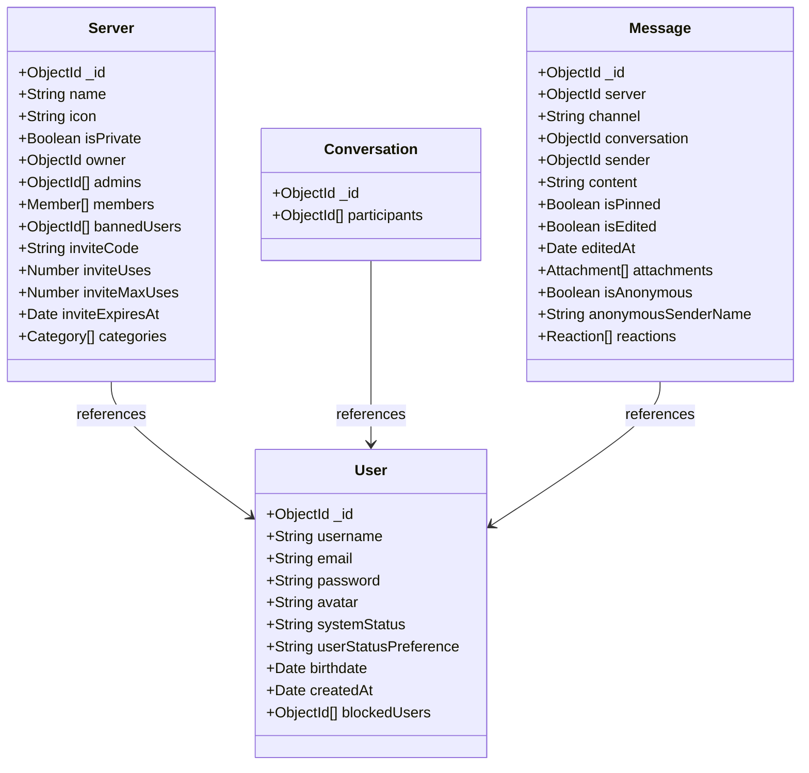
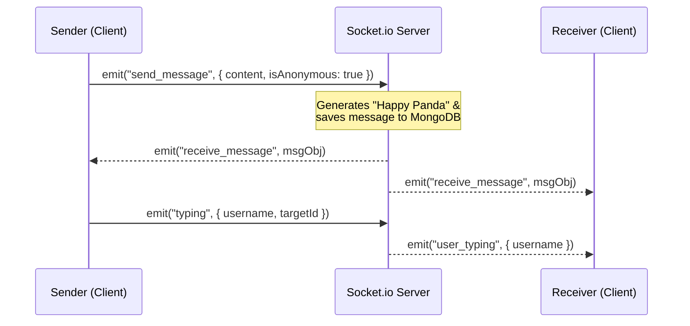

# 🏆 Discord Clone Server: Master System Blueprint & Documentation

This master documentation is a comprehensive blueprint of your simplified Discord Clone server. It covers the database models, API endpoints, real-time protocols, anonymous features, and deployment setups compiled throughout this session.

---

## 🏗️ 1. Project Goal & Design Core
The target is a high-performance, lightweight, deployment-ready Express + Socket.io + PeerJS server. 
* **Single-Port Architecture**: We bind Express, Socket.io, and PeerJS (`/peerjs`) to the same HTTP listener. The port is always read from `process.env.PORT` (set by the hosting provider at runtime) with a local fallback of `5001`:
  ```js
  // ✅ MANDATORY — never hardcode 5001 directly
  const PORT = process.env.PORT || 5001;
  server.listen(PORT, () => console.log(`Server running on port ${PORT}`));
  ```
  Render and Railway assign their own dynamic `PORT` values (e.g. `10000`). Hardcoding `5001` will cause the process to bind to the wrong port and silently fail in production.
* **Premium UX Features**: Out-of-the-box support for text categories, real-time typing indicators, pinned/edited messages, and unique anonymous messaging/reactions, as well as simple WebRTC voice and video rooms.

---

## 🗃️ 2. The Simple Database Schema Blueprint

Four main models form the foundation of our data store in MongoDB, designed to optimize read performance and take advantage of NoSQL document embedding.



### 👤 User Model (`models/User.js`)
Handles authentication, password hashing, active presence status, age checks, and block list states:
* `username`: Cleaned unique lowercase handle (e.g., `alex_dev`).
* `displayName`: Non-unique friendly display name (e.g., `Alex Dev`). Defaults to `username` upon creation.
* `email`: Lowercased unique email string.
* `password`: Securely encrypted via `bcryptjs` (auto-hashes on insertion/changes).
* `avatar`: Custom initials avatar generated on signup (`https://api.dicebear.com/7.x/initials/svg?seed=username`).
* `systemStatus`: Socket-driven connection presence enum (`['online', 'offline']`, defaults to `'offline'`).
* `userStatusPreference`: User-specified override enum (`['auto', 'online', 'idle', 'dnd', 'offline']`, defaults to `'auto'`).
* `birthdate`: Date object representing user's birthdate (enables client-side and backend age validation).
* `createdAt`: Date timestamp indicating account creation (defaults to `Date.now`).
* `blockedUsers`: Array of ObjectIds referencing other `User` profiles (utilized by the DM block validation engine).
* `anonymousNames`: Array of sub-documents mapping active context (servers/channels/DMs) to active anonymous display names:
  * `contextId`: ObjectId representing the context (e.g. Server ID, Channel ID, or Conversation ID).
  * `anonymousName`: The user's registered, non-conflicting anonymous name for this specific room/context (user-editable).
* `isVerified`: Boolean indicating if user's email has been verified via OTP (defaults to false).

### 🛡️ Server Model (`models/Server.js`)
Groups channel categories, lists members, manages admins, and handles invite link keys:
* `name`: Display name.
* `icon`: Display avatar url.
* `owner`: References `User` (the creator/ultimate manager of the server).
* `admins`: Array of ObjectIds referencing `User` (Moderators/administrators with permissions to delete messages, kick, or ban members).
* `members`: Array of sub-documents mapping users to their server-specific nicknames:
  * `user`: References `User` (the server member).
  * `nickname`: Custom server-specific nickname string (optional).
* `isPrivate`: Boolean flag. If `true`, the server cannot be joined via `/join-direct` — only via a valid invite code. Unauthenticated requests to view the server return a `"Server is private"` message. Defaults to `false`.
* `bannedUsers`: Array of ObjectIds of users blocked from entering (security constraint).
* `inviteCode`: Dynamic 8-digit unique string used to join.
* `inviteUses`: Number of times the current invite code has been used (default: `0`).
* `inviteMaxUses`: Maximum times the code can be consumed (optional, e.g. single-use).
* `inviteExpiresAt`: Timestamp when the active invite link expires (optional expiration).
* `categories`: Clumps of channels supporting custom drag order and renaming:
  * `name`: Category Group Name (e.g., `"GAMING CHANNELS"`).
  * `order`: Sorting hierarchy index.
  * `mutedUsers`: Array of ObjectIds referencing `User` (users who have muted this entire category).
  * `channels`: Sub-document array:
    * `name`: Lowercase, cleaned sub-channel path (e.g., `"general-chat"`).
    * `type`: Enum (`['text', 'voice']`). *(Note: 'voice' channels automatically support both audio and video screenshare streams via our PeerJS mesh).*
    * `description`: Topic description.
    * `isAnnouncement`: Boolean indicating a forced auto-subscribe announcement feed (defaults to `false`).
    * `createdAt`: Date timestamp indicating channel creation (defaults to `Date.now`).
    * `subscribers`: Array of ObjectIds referencing `User` (subscribers who follow this channel for custom notifications/real-time triggers).
    * `mutedUsers`: Array of ObjectIds referencing `User` (users who have specifically muted this individual channel).

### 💬 Conversation Model (`models/Conversation.js`)
Direct Message mapper tracking 1-on-1 private threads between exactly two users:
* `participants`: Array of exactly 2 User ObjectIds.

### 📩 Message Model (`models/Message.js`)
Houses chat logs for both servers and direct messages, including rich file metadata, reactions, pinning, and anonymity states:
* `server` / `channel`: References parent server and specific sub-channel path (optional).
* `conversation`: References direct message thread (optional).
* `sender`: References sending User.
* `content`: Text message string.
* `isPinned` / `isEdited`: Booleans indicating status.
* `editedAt`: Date timestamp of when the message was last modified (optional).
* `attachments`: Array of rich file attachment sub-documents:
  * `url`: String URL of file (uploads folder or CDN).
  * `fileType`: String MIME-type or category (e.g. `'image'`, `'video'`, `'pdf'`).
  * `fileName`: Original file name string.
  * `fileSize`: Number representing file size in bytes (allows rich user sizing feedback).
* `isAnonymous`: Boolean representing whether it was sent anonymously.
* `anonymousSenderName`: The user-defined or randomly generated anonymous name. If there is a context-wide name conflict, a dynamic numeric suffix (e.g. `MyAlias#1389`) is appended to prevent identity overlaps.
* `reactions`: Sub-document array of emoji interactions:
  * `emoji`: Unicode reaction key (e.g., `💖`).
  * `users`: Array of User IDs (for public reactions). A user may only appear once per emoji entry (enforced server-side).
  * `anonymousReactors`: Array of `{ anonymousName, realUserId }` sub-documents. Standard members only receive the `anonymousName` string list (retaining perfect privacy). Server Owners and Admins receive both fields, displaying the reactor's real `username` and `displayName` for moderation auditing.

### 🔔 Notifications — Client-Side Only (No Database Model)
**Deliberately cut** to save development time and database write overhead. Notifications are handled entirely as client-side Zustand state:
* **Unread badges**: A Zustand store tracks which channel IDs have unread messages. The badge clears when the user clicks the channel.
* **Mentions**: The Socket.io `receive_message` event carries a `mentions` array. The client checks if the logged-in user's ID is in that array and triggers a highlight — no DB write required.
* **DM pings**: A new DM message fires a `dm_notification` socket event directly to the recipient's socket room. Zustand state is updated instantly.

---

## 🗄️ 2.1 MongoDB NoSQL Architectural Optimization Details (Zero-Join Engine)

Unlike traditional SQL relational models which store every relationship as a unique row in junction tables and require intensive `JOIN` queries, this platform relies entirely on **MongoDB's NoSQL document nesting and atomic operations** to deliver extremely lightweight, high-performance execution.

### 🧩 A. Denormalized Nested Arrays vs. SQL Junction Tables
* **Embedded Channels**: In a relational model, channels reside in their own tables with foreign keys linked back to the Server ID. Under MongoDB, **channels are nested arrays of sub-documents inside categories directly inside the `Server` parent document**. Retrieving a server dynamically retrieves its channels, muted states, and sorting hierarchy inside one single database read operation, executing at $O(1)$ efficiency.
* **Many-to-Many Direct Arrays**: User blocks (`blockedUsers`), server administrators (`admins`), and banned members (`bannedUsers`) are modeled directly as arrays of dynamic ObjectIDs within the respective parent documents. MongoDB performs writes on these arrays using high-speed atomic operators:
  * **`$push`**: Appends elements (e.g. blocking a user, joining a server) instantly.
  * **`$pull`**: Extracts elements (e.g. unblocking a user, leaving a server) instantly.
  This bypasses transaction lockouts and table index overheads typical of SQL engines.

### 🎭 B. Double-Tiered Presence Status Logic (System-Driven vs. Manual Preferences)
To avoid continuous, CPU-heavy database status-writing when users connect or disconnect, presence is tracked in two tiers:
1. **`systemStatus` (Dynamic Socket State)**: Controlled dynamically by Socket.io connectivity state. When a user connects, their socket updates this parameter to `"online"`. On disconnect, it auto-flops to `"offline"`.
2. **`userStatusPreference` (User Override)**: Keeps track of manual selections (`"auto"`, `"online"`, `"idle"`, `"dnd"`, `"offline"`).
* **UI Resolution**: The client interface determines status dynamically: if `userStatusPreference` is `"auto"`, it inherits `systemStatus` directly. Otherwise, it displays their manual preference. This maintains instant real-time synchronization with zero complex state logic.

### 📡 C. Standard REST & WebSocket Execution (MVP Scope)
To ensure reliable 2-day MVP delivery and maintain clean, readable code for the internship interview:
* **WebSockets**: Standard `socket.io` events handle real-time message broadcasting and typing indicators. No need for complex sliding window ACKs or Redis syncing for 20 users.
* **Database**: Standard Mongoose schemas (`User`, `Server`, `Message`) execute basic CRUD logic. We avoid bucket patterns or custom caches to demonstrate clean, standard RESTful principles.
* **Video/Voice**: `PeerJS` provides an out-of-the-box WebRTC Mesh network. (Note: Mesh networking requires clients to upload streams multiple times, which easily supports our 20-user MVP scale without requiring a heavy SFU server).

### 🌲 D. Trie (Prefix Tree) In-Memory Invite Cache Spec
Even within our MVP, we can inject a touch of "genius" to impress your interviewers. To check dynamic server invite links in constant time ($O(L)$) without executing slow database index queries on MongoDB, we implement a custom in-memory **Trie (Prefix Tree)** cache.

#### 1. The Dynamic Trie Classes Structure
```javascript
class TrieNode {
  constructor() {
    this.children = {};      // Maps characters to child TrieNodes
    this.isEndOfCode = false; // Marks exact end of a valid invite code
    this.serverId = null;     // Cached Server ObjectID pointer for O(L) routing
  }
}

class InviteTrie {
  constructor() {
    this.root = new TrieNode();
  }

  // Insert invite code in O(L) time where L is length of invite code
  insert(code, serverId) {
    let node = this.root;
    for (const char of code) {
      if (!node.children[char]) node.children[char] = new TrieNode();
      node = node.children[char];
    }
    node.isEndOfCode = true;
    node.serverId = serverId;
  }

  // Search invite code in O(L) time
  search(code) {
    let node = this.root;
    for (const char of code) {
      if (!node.children[char]) return null;
      node = node.children[char];
    }
    return node.isEndOfCode ? node.serverId : null;
  }
}

// Global instance instantiated at server boot
const inviteCache = new InviteTrie();

// Seed the cache from the database at startup
const seedInviteCache = async () => {
  try {
    const servers = await Server.find({ inviteCode: { $ne: null } }, 'inviteCode _id');
    for (const server of servers) {
      inviteCache.insert(server.inviteCode, server._id.toString());
    }
    console.log(`Successfully seeded ${servers.length} invites into Trie Cache.`);
  } catch (err) {
    console.error("Failed to seed invite cache:", err);
  }
};
```
* **Why this is an interview winner**: Most junior engineers will just do `Server.findOne({ inviteCode: req.params.code })`. By adding a simple Trie wrapper, you demonstrate a deep understanding of algorithmic bounds, memory manipulation, and how to protect database connections from spam requests!
---

## 📡 3. HTTP REST API Endpoint Map

> **📌 Middleware Key**
> | Token | Behaviour |
> |---|---|
> | `protect` | Requires a valid JWT. Parsed from `Authorization: Bearer <token>` header or `token` cookie. Rejects unauthenticated requests with `401`. |
> | `optional-auth` | Decodes the JWT **if present** in the `Authorization` header or `token` cookie, and attaches `req.user`. If no token is sent, continues without error (`req.user = null`). Used on routes that serve different payloads to logged-in vs. anonymous visitors (e.g., `GET /api/servers/:serverId` hides data for private servers unless authenticated). |

| Route | HTTP Method | Request Body / Params | Middleware | Purpose |
| :--- | :--- | :--- | :--- | :--- |
| **`/api/auth/register`** | `POST` | `{ username, email, password, birthdate }` | None | Initiates registration, checks age limit, generates initials avatar, hashes password, saves pending user, and dispatches dynamic OTP. |
| **`/api/auth/verify-otp`** | `POST` | `{ email, code }` | None | Verifies OTP code. If valid, marks user as verified, sets HTTP-only cookie, and returns JWT. |
| **`/api/auth/resend-otp`** | `POST` | `{ email }` | None | Re-generates and dispatches a fresh OTP code for the user. |
| **`/api/auth/login`** | `POST` | `{ email, password }` | None | Authenticates credentials, sets secure HTTP-only cookie, and returns JWT token. |
| **`/api/auth/logout`** | `POST` | None | None | Clears the authenticated `token` HTTP-only session cookie. |
| **`/api/auth/me`** | `GET` | None | `protect` | Load authenticated user's profile context. |
| **`/api/auth/users`** | `GET` | None | `protect` | Fetch other registered users in the database to start a DM. |
| **`/api/users/block/:userId`** | `POST` | `userId` param | `protect` | Toggle blocking/unblocking a target user from sending direct messages. |
| **`/api/servers`** | `POST` | `{ name, icon, isPrivate }` | `protect` | Create server, assign owner, and auto-populate default channels. |
| **`/api/servers`** | `GET` | None | `protect` | Fetch all servers the authenticated user is a member of. |
| **`/api/servers/join/:inviteCode`** | `POST` | `inviteCode` param | `protect` | Instantly join a server using its unique invite code link (Bypasses private server locks). |
| **`/api/servers/invite-details/:inviteCode`** | `GET` | `inviteCode` param | None | Publicly fetch basic server summary (name, icon, banner, owner, member counts) to render the landing page anonymously before logging in. |
| **`/api/servers/:serverId`** | `GET` | `serverId` param | `optional-auth` | Fetch server details (name, icon, member counts, public channels). If `isPrivate: true` **and** the requester is not an authenticated member, returns `{ error: "Server is private" }` with a `403`. Authenticated members always receive full data. |
| **`/api/servers/:serverId/join-direct`**| `POST` | `serverId` param | `protect` | Direct attempt to join by ID. If `isPrivate: true`, returns error: `"Server is private and you cannot join!"`. |
| **`/api/servers/:serverId/leave`** | `POST` | `serverId` param | `protect` | Remove authenticated user from server member list. |
| **`/api/servers/:serverId/kick/:userId`** | `POST` | `serverId`, `userId` params | `protect` | Kick a user from the server (Only Server Admins / Owner). |
| **`/api/servers/:serverId/ban/:userId`** | `POST` | `serverId`, `userId` params | `protect` | Ban user and add to bannedUsers list (Only Server Admins / Owner). |
| **`/api/messages/search`** | `GET` | `{ query, channelId?, conversationId? }` query params | `protect` | Scoped full-text search. Enforces `400` if both/neither scope params are sent. Restricts access (`403`) unless the user is a member of the server/channel or a participant in the DM conversation. |
| **`/api/servers/:serverId/channels`** | `POST` | `{ name, type, description }` | `protect` | Create text or voice sub-channel inside category (Only Server Owner). |
| **`/api/servers/:serverId/channels/:channelId/subscribe`** | `POST` | None | `protect` | Toggle subscribing/unsubscribing to a specific channel's real-time alerts. |
| **`/api/servers/:serverId/channels/:channelId/mute`** | `POST` | None | `protect` | Toggle muting/unmuting notifications for a specific channel. |
| **`/api/servers/:serverId/categories/:categoryId/mute`** | `POST` | None | `protect` | Toggle muting/unmuting notifications for an entire category clump. |
| **`/api/conversations`** | `POST` | `{ recipientId }` | `protect` | Find or create a 1-on-1 conversation thread. |
| **`/api/conversations`** | `GET` | None | `protect` | Fetch active DM conversations. |
| **`/api/messages/channel/:channelId`** | `GET` | `channelId` param | `protect` | Get last 100 chronological messages for a channel. |
| **`/api/messages/conversation/:conversationId`**| `GET` | `conversationId` param | `protect` | Get last 100 chronological messages in a private DM thread. |
| **`/api/messages/pin/:messageId`** | `PUT` | `messageId` param | `protect` | Toggle pinned state of a message (`isPinned` boolean). |
| **`/api/messages/edit/:messageId`** | `PUT` | `{ content }` | `protect` | Edit message content, marks `isEdited = true` (Owner only). |
| **`/api/messages/:messageId`** | `DELETE`| `messageId` param | `protect` | Delete message (Permitted only to Message Sender or Server Admins). |
| **`/api/messages/upload-url`** | `POST` | `{ fileName, fileType }` | `protect` | Generate a Cloudflare R2 pre-signed URL for direct client-side file uploads. |

---

## ⚡ 4. Real-Time WebSockets Engine (`index.js`)

Socket.io syncs actions across connections instantly.



### Core Socket Events:
* **`user_online` / `disconnect`**: Automatically updates online/offline state in MongoDB and broadcasts `user_status_changed` to update visual avatar status rings.
* **`send_message` / `receive_message`**: Saves message in DB, populates sender details, and broadcasts to room. If message is sent in a channel, triggers `channel_notification` sockets directly to all of the channel's `subscribers` (excluding the sender).
* **`typing` / `stop_typing`**: Pushes name-keyed typing indicators to targeted chat rooms.
* **`add_reaction` / `remove_reaction`**: Manages emojis, updates public or anonymous reactor lists in MongoDB, and pushes `message_updated` payloads.
* **`edit_message` / `delete_message`**: Triggers instantaneous message feed updates or deletes on the screen without full room reloads.
* **`join_voice` / `leave_voice`**: Registers user Peer IDs in targeted rooms, broadcasting peer handshake keys so clients can establish direct WebRTC voice/video sessions.

---

## 🎭 5. Anonymous Name Generation Helper & Collision Prevention

To create random animal-adjective identities when users toggle anonymity, we use a utility helper:

```javascript
export const generateAnonymousName = () => {
  const adjectives = ['Happy', 'Sleepy', 'Silly', 'Spunky', 'Golden', 'Mysterious', 'Sneaky', 'Swift', 'Jolly', 'Gentle'];
  const animals = ['Panda', 'Dolphin', 'Koala', 'Cheetah', 'Wolf', 'Fox', 'Tiger', 'Falcon', 'Otter', 'Badger'];
  
  const randomAdj = adjectives[Math.floor(Math.random() * adjectives.length)];
  const randomAnim = animals[Math.floor(Math.random() * animals.length)];
  
  return `${randomAdj} ${randomAnim}`;
};
```

### 🛡️ Non-Conflict & Uniqueness Rules in Database
To prevent duplicate active anonymous identities within the same chat context (channel or DM conversation), the server enforces the following validation checks:
* **Allow Any Custom Name**: Users can select ANY custom anonymous name they wish (it does not have to be generated).
* **Automatic Conflict Resolution**: If a user selects a custom anonymous name that conflicts with an existing active anonymous name in that context, the system automatically appends a dynamic 4-digit numeric suffix (e.g., `"MyAlias#1389"`) to guarantee non-conflict.
* **Admin Privilege & Disclosure**: To audit logs and stop trolling, Server Owners and Admins are excluded from anonymous stripping. When they view messages or reactions, the backend populates the real sender's `username` and `displayName` alongside their `anonymousSenderName`. Standard users only see the anonymous identity.

---

## 🔔 6. Premium Notification & Mention Architecture

### 🔇 1. Notification State Lifecycle
Every channel has a granular notification state progression:
1. **Initial Join State (Subscribed to None)**: When a user joins a server, they are subscribed to **none** of the channels. They do not get unread count badges, sounds, or push notifications. They can view channels passively.
2. **Subscribed State (Unmuted by Default)**: When a user explicitly clicks **"Subscribe"** on a channel:
   * It becomes **unmuted by default**.
   * The user gets real-time sounds and desktop notifications.
   * A **small red circle badge** highlights the channel if there are missed messages since their `lastReadAt` timestamp.
3. **Muted State**: After subscribing, the user can choose to **"Mute"** the channel:
   * Suppresses general push alerts, unread message badges, and sound triggers.
   * Keeps their subscription connection intact so they can unmute it easily at any time.
   * **Direct Mentions Override Mute**: Even when in a muted state, if the user is specifically tag-mentioned (using `@username` or `@all`), they will **still** receive a real-time sound/alert and highlight notification!

### 📣 2. Mention Engine (`@all` & `@username`)
* **Mentions Bypass Silences**: When a message contains a mention, it instantly **overrides** all default-mute and unsubscribe locks:
  * **`@all`**: Mentions every member of the server. Every member (excluding the sender) gets an immediate highlight notification.
  * **`@username`** (e.g., `@alex`): Target-mentions that specific user, pushing a dedicated, direct alert to their tray.
* **Bypassing Rules**: Even if a channel is unsubscribed or manually muted, a direct mention triggers a persistent unread badge and push notify event.

### 🚫 3. Global DND (Do Not Disturb) Status Suppression
* **Ultimate Silence**: If a user sets their status to **`dnd` (Do Not Disturb)**, the WebSockets server **silences all sound and visual push notification alerts globally**, even for direct `@mentions` and private DMs!
* **Passive Indicator Only**: They will still receive the silent red unread circles in their sidebar list, but their device will not sound or popup while DND is active.

### 📢 4. Force-Subscribe Announcement Channels
* **Default Announcement Channels**: Server categories can contain channels marked with `isAnnouncement: true` (e.g., `#rules` or `#announcements`).
* **Auto-Opt-In on Join**: When a user joins a server, they are **automatically subscribed** to all announcement channels by default (unmuted). They can manually unsubscribe or mute them later if desired.

### ✨ 5. Mention Highlight Glow (Client-Side)
* **Visual Glow Card**: When the client-side UI renders a message containing a mention targeted at the authenticated user, it applies a rich thematic styling:
  * **Background**: A warm, translucent golden/amber gradient overlay.
  * **Left Accent Border**: A thick `3px` solid amber accent border (`#D4AF37`) running along the left margin of the message card.
  * **Visual Contrast**: Provides immediate visual separation of personal highlights when scanning the chat feed.

### 🎉 6. Dynamic Welcome Announcements
* **System Event trigger**: On successful execution of `POST /api/servers/join/:inviteCode`, the backend automatically generates a system welcome post in the server's default text channel:
  * **Sender**: A specialized mock-user `"System"` with `isSystem: true`.
  * **Content**: `"🎉 Welcome @username to the server! Say hello!"`
* **Real-time broadcast**: The welcome message is broadcast via Socket.io to all online server members.

### 🟢 7. Server Presence Counters
* **Real-time lookup**: When retrieving server context (`GET /api/servers/:serverId`), the database performs a live lookup across the server's `members` collection:
  * **onlineCount**: Returns count of members with `status` of `'online'`, `'idle'`, or `'dnd'`.
  * **totalMembers**: Returns count of all members in the server.
* **Payload**: Returned inline inside the main server object to minimize client-side overhead.

### ⏱️ 8. Channel Unread Badges (Client-Side Only)
* **No database model required.** Unread state is tracked entirely in Zustand.
* When a `receive_message` socket event fires for a channel the user is not currently viewing, Zustand increments that channel's unread count in memory.
* Opening a channel dispatches a Zustand action that resets its unread count to `0`. Zero DB writes.

### 🌐 9. Dynamic Browser Tab Title Indicator
* **Tab Focus State Sync**: When a user is in another tab (or your tab is unfocused), receiving direct mentions or direct messages dynamically alters the HTML Document Title (e.g., `(3) 🔴 Discord`) to alert them of missed messages without forcing desktop notification dialogs.
* **The Implementation**:
  ```javascript
  let missedMentions = 0;
  
  socket.on("receive_message", (message) => {
    if (!document.hasFocus() && isMentioned(message)) {
      missedMentions++;
      document.title = `(${missedMentions}) 🔴 Discord`;
    }
  });

  window.addEventListener("focus", () => {
    missedMentions = 0;
    document.title = "Discord"; // Restores pristine tab title upon window focus
  });
  ```

### 🔊 10. Premium Audio Alert Debouncer & Spam Safeguard
* **Anti-Spam Sound Guard**: If a user is spammed with rapid-fire `@all` mentions or private DMs, playing standard audio files back-to-back will trigger a deafening, overlapping audio blast.
* **The Implementation**: We debounce notification sounds, limiting audio alerts to a maximum of **once every 1.5 seconds**, while still incrementing unread counters visually:
  ```javascript
  let lastNotificationSoundTime = 0;

  const playSystemNotificationSound = () => {
    const now = Date.now();
    if (now - lastNotificationSoundTime < 1500) {
      console.log("Suppressing overlapping sound alert to prevent ear fatigue.");
      return; // Ignore sub-second audio triggers
    }
    
    lastNotificationSoundTime = now;
    const alertAudio = new Audio("/assets/sounds/discord_notify.mp3");
    alertAudio.volume = 0.45; // Premium, low-fatigue level
    alertAudio.play().catch(e => console.warn("Browser audio auto-play gesture block:", e));
  };
  ```

---

## 🖼️ 7. Unified Lightweight Media Engine: Emojis, Giphy & Auto-Conversions

To keep the platform exceptionally lightweight, performance-optimized, and free of expensive storage plans, we build a seamless, self-contained media and interactive chat engine that serves both servers and direct message feeds.

### 🎭 1. Client-Side Emojis & Giphy Integration
* **Zero-Storage footprint Giphy**: Instead of uploading GIFs, the client embeds an interactive Giphy picker that communicates directly with the Giphy API. The payload saved to MongoDB is just a lightweight Giphy URL string, consuming zero server space:
  ```javascript
  // Express Proxy endpoint (keeps Giphy API Key hidden from client)
  app.get("/api/gifs/search", async (req, res) => {
    const { query, limit = 20 } = req.query;
    try {
      const response = await fetch(
        `https://api.giphy.com/v1/gifs/search?api_key=\${process.env.GIPHY_API_KEY}&q=\${encodeURIComponent(query)}&limit=\${limit}`
      );
      const data = await response.json();
      const gifUrls = data.data.map(gif => ({
        id: gif.id,
        preview: gif.images.fixed_width_small.url,
        url: gif.images.original.url
      }));
      res.json(gifUrls);
    } catch (err) {
      res.status(500).json({ error: "Failed to fetch GIFs from Giphy" });
    }
  });
  ```
* **Performance Emoji Keyboard**: Emojis are inserted into the chat area via an optimized, custom dropdown emoji panel. Emoji keys are stored as pure Unicode characters in the `content` field, requiring zero processing overhead.

### 🔄 2. Cloudflare R2 Direct Upload Pipeline (Zero Server CPU)
All file uploads bypass the Node.js server entirely using Cloudflare R2 pre-signed URLs:
* **Images**: Compressed to `.webp` on the client via the Canvas API (see below) before uploading directly to R2.
* **Videos & other files**: Uploaded directly to R2 **as-is** with no conversion. No FFmpeg, no server-side transcoding. The client requests a pre-signed URL from our backend (`POST /api/messages/upload-url`), then `PUT`s the file straight to Cloudflare — the backend never touches the binary data.

#### 📁 A. Client-Side Image-to-WebP Compressor (Canvas API)
Executed instantaneously inside the browser using standard canvas drawing APIs, this downscales heavy images and encodes them to highly-efficient `.webp` with near-zero latency:
```javascript
const compressImageToWebP = (file) => {
  return new Promise((resolve) => {
    const img = new Image();
    img.src = URL.createObjectURL(file);
    
    img.onload = () => {
      const canvas = document.createElement("canvas");
      // Downscale massive prints to a max width of 1200px (retaining visual quality)
      canvas.width = Math.min(img.width, 1200);
      canvas.height = (canvas.width / img.width) * img.height;

      const ctx = canvas.getContext("2d");
      ctx.drawImage(img, 0, 0, canvas.width, canvas.height);

      canvas.toBlob((blob) => {
        const compressedFile = new File([blob], `img-${Date.now()}.webp`, {
          type: "image/webp"
        });
        resolve(compressedFile);
      }, "image/webp", 0.8); // 80% compression quality sweet-spot
    };
  });
};
```


---

## 🚀 8. Deployed Environment Configuration

### 📦 Render / Railway Environment Variables:
```env
# PORT is injected automatically by Render/Railway — do NOT set it manually here.
# process.env.PORT is read at runtime; the fallback in code is 5001 for local dev.
MONGODB_URI=mongodb+srv://<DB_USER>:<DB_PASSWORD>@<CLUSTER>.mongodb.net/discord-clone
JWT_SECRET=super_secret_key_change_in_production
CLIENT_URL=https://your-discord-app.vercel.app
NODE_ENV=production
GIPHY_API_KEY=your_giphy_api_key_here
CLOUDFLARE_R2_ACCOUNT_ID=your_account_id
CLOUDFLARE_R2_ACCESS_KEY_ID=your_access_key
CLOUDFLARE_R2_SECRET_ACCESS_KEY=your_secret_key
CLOUDFLARE_R2_BUCKET_NAME=discord-clone-assets
```

> **⚠️ CORS & Frontend credentials Configuration (Mandatory)**: The Express server must set CORS origin to `process.env.CLIENT_URL`. Without this, every browser request from the React client will be blocked by CORS policy.
> 
> **Server-Side CORS Setup**:
> ```js
> import cors from 'cors';
> app.use(cors({
>   origin: process.env.CLIENT_URL,
>   credentials: true  // Required for cookies / Authorization headers
> }));
> ```
>
> **Client-Side Axios/Fetch Setup**:
> To ensure the authorization token (and potentially cookies) are sent with every API request, the React frontend must globally configure its client instance (e.g. Axios) to send credentials:
> ```js
> import axios from 'axios';
> 
> const api = axios.create({
>   baseURL: process.env.REACT_APP_API_URL || 'http://localhost:5001',
>   withCredentials: true // MANDATORY — matches credentials: true on server
> });
> ```

### 🔊 Connecting Your React Client:
```javascript
import { io } from "socket.io-client";
import { Peer } from "peerjs";

// WebSockets Connection
export const socket = io("https://your-backend.onrender.com");

// WebRTC PeerJS Connection (Targets same port, using secure SSL & STUN configuration)
export const peer = new Peer(undefined, {
  host: "your-backend.onrender.com",
  port: 443,
  path: "/peerjs",
  secure: true,
  config: {
    iceServers: [
      { urls: "stun:stun.l.google.com:19302" },
      { urls: "stun:stun1.l.google.com:19302" }
    ]
  }
});
```

---

## 🎙️ 9. WebRTC Voice/Video Mesh Architecture
Because we use WebRTC (via PeerJS), we avoid needing a complex central media server (SFU). Instead, clients connect directly to each other using a simple **Mesh Network**. 

### 🌐 The Peer-to-Peer Concept
1. **The Handshake (Signaling):** A user joins a Voice Channel and gets a unique `peerId`. They broadcast this ID to the room via our Node.js/Socket.io backend. This takes almost zero bandwidth.
2. **The Direct Connection (Media):** Every other user receives the ID and initiates a `peer.call(peerId, stream)`. A direct, encrypted tunnel opens between the users' laptops. The heavy video/audio traffic flows directly across the internet, completely bypassing our backend (saving server CPU and bandwidth).
> **⚠️ Mesh Scaling Limit (Documented):** In a P2P mesh, every peer must upload their stream to every other peer. With `N` participants, each client maintains `N-1` outgoing streams. At **N=5**, that is 4 simultaneous uploads per device; at **N=10**, it is 9. This is sustainable on modern home broadband (~5–10 Mbps upload) but becomes strained beyond ~10 participants. This is an **intentional, documented MVP constraint** — the correct production fix is replacing the mesh with a Selective Forwarding Unit (SFU) like mediasoup or LiveKit, which centralises stream routing. For our 5-day, ≤20-user target this is perfectly fine.

### 📡 STUN Servers (Public IP Discovery)
To connect Peer-to-Peer, computers need to know their public IP address (which is hidden behind home WiFi routers/NATs). 
* We use **Google's Free STUN Servers** (`stun:stun.l.google.com:19302`).
* A STUN server is simply an internet information desk: Your browser asks it "What is my public IP?", it echoes back the IP, and then your browser sends that IP to the other peers so they can connect directly.

### 💻 Screen, Tab, and System Audio Sharing
We rely on native browser APIs to handle complex media sharing without custom plugins:
* **Display Media API**: We call `navigator.mediaDevices.getDisplayMedia({ video: true, audio: true })`. This triggers the browser's native screen picker.
* **System Audio**: Because we pass `audio: true`, the user can check "Share system/tab audio" in the browser popup, automatically streaming YouTube or local audio into the call.

### 🎛️ Client-Side Audio Filtering (Zero Backend Processing)
To ensure professional audio quality without server load, we use the browser's native audio processing engine when capturing the microphone:
```javascript
navigator.mediaDevices.getUserMedia({ 
  audio: { 
    echoCancellation: true,   // Stops the call from echoing
    noiseSuppression: true,   // Filters out background fans/keyboards
    autoGainControl: true     // Automatically adjusts volume if they whisper or yell
  } 
});
```

---

## 🛡️ 10. Robustness & Security (Enterprise Standards)
Even on a fast 2-day MVP timeline, demonstrating that you write "robust, defensive code" is what elevates you from a junior dev to an intern that companies desperately want to hire. We will enforce the following 4 pillars of robustness:

### 1. Global Error Handling Middleware
Instead of messy `try/catch` blocks sending inconsistent JSON responses across 30 different controllers, we use a single centralized Error Handler. It catches everything—from database timeouts to bad JWT tokens—and formats them into a strict standard response:
```javascript
// Example Standard Response Structure
{
  "success": false,
  "error": "Duplicate username detected.",
  "statusCode": 400
}
```

### 2. Graceful Shutdowns (Process Management)
When the hosting provider (like Render or Vercel) reboots the server or pushes an update, they send a `SIGTERM` signal. A brittle app just crashes mid-request. A robust app handles it:
* It stops accepting new HTTP traffic.
* It finishes processing active requests.
* It safely closes the MongoDB connection pool (`mongoose.connection.close()`).
* It exits safely with `process.exit(0)`.

### 3. XSS (Cross-Site Scripting) & Injection Protection
Users will try to paste malicious `<script>` tags into the chat input. 
* We will use a fast sanitizer (like `xss-clean` or simple RegExp stripping) on the backend before saving `content` to MongoDB. 
* We will sanitize MongoDB queries to prevent NoSQL injection attacks (e.g. someone putting `{"$gt": ""}` in the password field).

### 4. API Rate Limiting (DDoS Protection)
We will wrap the `auth` and `messages` routes in a lightweight `express-rate-limit` window. This prevents a malicious script from rapidly creating 10,000 servers in one second and crashing our free MongoDB Atlas cluster.

---

## ⏱️ 11. 5-Day MVP Scope & Tech Stack Constraints
To strictly finish the full-stack project in 5 days while remaining within the assessment's rules, the following stack and scope limitations are permanently enforced:

### Approved Tech Stack
1. **Frontend State**: **Zustand**. Zero-boilerplate global state. No Redux.
2. **Styling**: **Pure CSS (with CSS Modules)**. We will use CSS Modules (e.g. `Chat.module.css`) to prevent global style collisions, strictly adhering to the "Pure CSS" requirement without suffering layout nightmares.
3. **Storage**: **Cloudflare R2**. We will bypass the Node.js server and generate pre-signed URLs to upload avatars/attachments directly from the React client to Cloudflare R2.
4. **Search**: **MongoDB `$text` Indices**. We will implement a lightning-fast search using native MongoDB indexing (`$text`), avoiding complex regex matching.
   > **⚠️ Index Declaration Required**: The `$text` index **must** be declared on the `Message` model's `content` field or the search route will throw a runtime error:
   > ```js
   > // In models/Message.js — add this to the schema definition
   > MessageSchema.index({ content: 'text' });
   > ```
   > **⚠️ Validation & Scope Enforcements**:
   > 1. **Exclusive Scopes**: The query must specify exactly **one** scope: either `channelId` or `conversationId`. If both or neither are provided, the route returns `400 Bad Request`.
   > 2. **Access Control (Authorization)**: Before returning search results, the server **must** verify the requesting user's authorization to access the messages:
   >    * **For Channel Search**: The server must verify that the user is a registered member of the parent server.
   >    * **For DM Search**: The server must verify that the user is one of the participants of the target conversation.
   >    * If the check fails, the server rejects the request with a `403 Forbidden` (`"Access Denied: You are not authorized to view messages in this scope."`).
   >
   > **⚠️ Search Execution**:
   > ```js
   > // Channel search (after verifying server membership)
   > const results = await Message.find({
   >   channel: channelId,          // ← scope to the single channel
   >   $text: { $search: query }
   > }, { score: { $meta: 'textScore' } })
   >   .sort({ score: { $meta: 'textScore' } })
   >   .limit(50);
   >
   > // DM conversation search (after verifying conversation participation)
   > const results = await Message.find({
   >   conversation: conversationId, // ← scope to the single DM thread
   >   $text: { $search: query }
   > }, { score: { $meta: 'textScore' } })
   >   .sort({ score: { $meta: 'textScore' } })
   >   .limit(50);
   > ```
5. **Auth / Email Validation**: **Nodemailer + Mailtrap/SendGrid**. We will generate secure OTPs/tokens, store them in MongoDB, and send real verification emails to ensure the auth flow is robust.
   > **📌 OTP Schema (Required)**: Create a dedicated `Otp` model (not embedded in `User`) so the TTL index can cleanly purge expired documents:
   > ```js
   > const OtpSchema = new mongoose.Schema({
   >   email:     { type: String, required: true },
   >   otp:       { type: String, required: true }, // bcrypt-hashed before storage
   >   expiresAt: { type: Date, required: true, index: { expireAfterSeconds: 0 } }
   > });
   > ```
   > Set `expiresAt` to `Date.now() + 10 * 60 * 1000` (10 minutes) on creation. MongoDB's TTL worker auto-deletes expired documents.
   > **⚠️ TTL Index Required**: OTP documents stored in MongoDB **must** include an `expiresAt` field with a MongoDB TTL index (`expireAfterSeconds: 0`). Without this, stale OTP documents accumulate indefinitely and bloat the collection. Set OTP lifetime to **10 minutes**.

### Excluded "Fancy" Features (To Guarantee 5-Day Delivery)
To stay on schedule, we **MUST NOT** implement the following overly-complex features:
1. **Granular Role-Based Permissions**: We will only have "Owner/Admin" and "Member". Do not implement Discord-style customizable roles (where users can toggle 30 different permissions like "Can Manage Emojis").
2. **Message Threading (Replies)**: Do not build sub-threads. Threads act like miniature hidden channels and require complex database relational linking and UI nesting.
3. **Per-Message Read Receipts**: Do not track "Seen by X, Y, Z" for every message. In WebSockets, tracking individual read states for 20 users per message causes massive state bloat. Unread channel badges are sufficient.
4. **Rich Text Formatting (Markdown Parsers)**: Do not spend hours building a complex parser to render bold, italics, spoilers, and code blocks. Stick to standard text rendering for the MVP.
5. **Server-Side Video Recording**: Since we are using PeerJS (P2P Mesh), adding a recording feature would require routing streams through a centralized server, destroying our simple architecture. No call recording.
6. **Advanced Edge-Case Safeguards**: To hit our strict 5-day delivery target, we explicitly defer the following advanced edge-case systems:
   * **In-Memory Trie Cache Invalidation**: The cache is purely seeded at boot for immediate constant-time join checks. Dynamic deletion of invite keys from the Trie on expiration or deletion is deferred.
   * **Multi-Device Session/Connection Counting**: A user is treated as having a single connection. The system presence (`systemStatus`) toggles between online/offline directly on socket connection/disconnection without tracking concurrent device counters.
   * **Horizontal Scaling & Socket JWT Handshake Security**: The server is architected as a single-instance node process. Multi-instance Redis Pub/Sub syncing and custom socket handshake validations are out of scope. Standard endpoint-level JWT validation is sufficient.

---

## 🧠 12. Architectural Rationale (The "Why")
During the technical interview, explaining *why* we chose this stack is just as important as the code itself. Here is the defense for our architectural decisions:

1. **Why Express/Node.js?**
   * **Reasoning**: It is non-blocking and single-threaded. This architecture is structurally perfect for long-lived WebSocket connections (Socket.io) because it can handle thousands of concurrent idle connections without spinning up heavy system threads for each one.
2. **Why MongoDB?**
   * **Reasoning**: A Discord clone requires deeply nested, hierarchical structures (e.g., A Server has many Categories, which have many Channels). MongoDB's document model allows us to model these relationships naturally. Additionally, its schema flexibility allows us to easily add features like "Reactions" or "Attachments" to a message later without expensive SQL migrations.
3. **Why WebRTC (PeerJS) instead of an SFU Media Server?**
   * **Reasoning**: We need to guarantee that we can deliver this within 5 days and host it for free. An SFU (centralized media server) requires massive backend bandwidth and complex infrastructure. By using a WebRTC Mesh Network, the heavy video traffic bypasses our backend entirely, reducing our server load to zero while still providing lightning-fast latency for small group calls.
4. **Why Cloudflare R2 instead of MongoDB GridFS or Local Disk?**
   * **Reasoning**: Storing images on the local Node.js disk destroys scalability (if we spin up a second backend server, it won't have the files). MongoDB GridFS is slow and expensive for binary data. Cloudflare R2 provides an S3-compatible API with zero egress fees, and generating "pre-signed URLs" allows clients to upload directly to the bucket, keeping our Node.js server entirely free of file-processing CPU spikes.
5. **Why Zustand over Redux?**
   * **Reasoning**: Redux is extremely verbose and requires heavy boilerplate (actions, reducers, dispatchers). For an MVP, speed is key. Zustand provides the exact same global state capabilities (crucial for keeping the active channel UI and chat WebSocket synchronized) but requires a fraction of the code, reducing bug surface area and development time.

---

## 📌 13. Architectural Implementation Reminders

These are documented decisions and implementation constraints surfaced during blueprint review. Treat them as binding rules during coding.

### 🎭 1. Secure Anonymous Reaction Ownership & Admin Disclosure
To balance user privacy with strong server moderation, anonymous messages and reactions are fully trackable by server administrators in the database:
* **Database Tracking**: The `Message` collection's `sender` field and the reaction's sub-document always record the real sender's/reactor's `userId` in MongoDB.
* **API Filtering (Role-Based)**: 
  * **Standard Members**: When loading messages or reactions, the controller strips the real user's details and returns only the anonymous name.
  * **Owners & Admins**: The controller leaves the real user details intact, displaying their real `username` and `displayName` to support audit logs and combat abuse.
* **Secure Reaction Removal**: When a user removes an anonymous reaction, the server validates it using their authenticated `userId` on the server-side, preventing someone from removing reactions they do not own.

### ⚛️ 2. Presence Resolution — Single Zustand Selector (Mandatory)
The double-tiered presence logic (`systemStatus` + `userStatusPreference`) **must be resolved in exactly one place** on the client: a dedicated Zustand selector. Do **not** scatter this logic across components.

```javascript
// ✅ CORRECT — single derived selector in the Zustand store
const useDisplayStatus = (userId) =>
  useStore((state) => {
    const user = state.users[userId];
    if (!user) return "offline";
    // If manual preference is set, honour it; otherwise inherit socket-driven state
    return user.userStatusPreference === "auto"
      ? user.systemStatus         // Socket.io driven (online / offline)
      : user.userStatusPreference; // Manual override (idle / dnd / online / offline)
  });

// ✅ Usage in any component — consume only, never re-derive
const status = useDisplayStatus(user._id);
```
> Every avatar status ring, sidebar presence dot, and member list indicator must call **only** `useDisplayStatus`. Never read `systemStatus` or `userStatusPreference` directly inside a component.

### 🔕 3. DND Silences Everything — Including @mentions (By Design)
When a user sets their status to **`dnd` (Do Not Disturb)**, the client suppresses **all** audio and visual push alerts — including direct `@username` mentions, `@all` broadcasts, and private DMs.
* **Passive indicator only**: Silent red unread badge circles still appear in the sidebar.
* **This matches Discord's production DND behaviour** and is intentional, not a bug.
* Enforcement point: the `playSystemNotificationSound()` debouncer (§6.10) must check `userStatusPreference === 'dnd'` before playing any audio or triggering any desktop notification API call.

### 🌐 4. Centralized REST Client Integration via Axios (`utils/api.ts`)
To eliminate the brittle custom `API_BASE` definitions scattered across multiple files, the entire REST and file upload request pipeline has been fully refactored into a single central Axios client:
* **The Client Instance**: Instantiated globally via `axios.create` with unified fallback boundaries matching dynamic dev (`http://localhost:5001/api`) vs. remote environments seamlessly.
* **Automatic JWT Credentials Injection**: Installs a request interceptor that queries `localStorage.getItem('token')` dynamically and appends an `Authorization: Bearer <token>` header to all outgoing requests. React components no longer need to pass explicit token states.
* **Session Expiration Guard**: Implements a response interceptor catching `401 Unauthorized` errors globally, providing warning triggers to user context stores.
* **Error Normalization**: Standardizes request exception payloads on both client and backend, allowing safe, clean catch handling inside TSX handlers.

### 🎭 5. Anonymous Invite Landing Page Routing
To deliver a premium, seamless boarding experience for prospective users:
* **No Pre-Authentication Gate**: Fetching invitation specifics is exposed publicly on `/api/servers/invite-details/:inviteCode` without requiring a valid JWT bearer.
* **Landing Page Presentation**: Invitee candidates landing on `/invite/:inviteCode` instantly retrieve the host server's summary metadata (name, description, banner styling, host details, and total member counts) anonymously.
* **Session-Aware Onboarding**:
  * If the user already possesses an active session token, the UI renders an immediate `Accept Invite & Join` CTA.
  * If the guest is anonymous (no active JWT token), the UI displays clear registration/sign-in options, storing the target `pendingInvite` code in `localStorage` to automatically resolve the membership link instantly upon successful credential verification.

### 👞 6. Kicking & Membership Visibility Isolation
To guarantee absolute safety, isolation, and security when moderators perform administrative actions:
* **Real-time Eviction**: When an administrator kicks a member, the server strips their user ID from the server's `members` collection and forces their socket connections to leave all server/channel rooms.
* **Visibility Deletion**: Since the member list resolves dynamically based on active membership arrays, the evicted user immediately loses read/write visibility. The server is dynamically removed from their sidebar lists, and all sub-channels vanish from view.
* **UI Redirection Safety**: The frontend catches eviction triggers or active server list updates immediately, cleanly redirecting the evicted member's focus away from the deleted channels to the primary Direct Messages home feed to prevent UI errors or data leaks.

### 🚀 7. Production Deployment Checklist
Follow these protocols to successfully build, serve, and launch the application in production (e.g., Render, Railway, or Vercel):
1. **Unified Single-Port Boot**: Ensure the Node.js server binds entirely to `process.env.PORT` with no hardcoded fallback port exceptions in production environments.
2. **CORS Alignment**: Define `process.env.CLIENT_URL` inside the host settings matching the exact public Vercel/Render frontend domain to permit authenticated resource sharing.
3. **Frontend Build Pipeline**: Compile the React client utilizing clean TypeScript builds (`npm run build`). Check that the compiled folder (`dist/` or `build/`) is properly provisioned.
4. **Environment Variables Verification**: Check that all credentials (`MONGODB_URI`, `JWT_SECRET`, `GIPHY_API_KEY`, and Cloudflare R2 S3 secrets) are populated in the platform's Environment Settings dashboard before triggering the final deploy pipeline.
5. **Cloudflare Workers Deployment**:
   * Compile the server with `npm run build` inside the `server` directory to bundle all controllers, models, and dependencies into a single ESM/CJS file at `dist/index.cjs`.
   * The server config leverages `wrangler.toml` specifying the entry point as `dist/index.cjs` and enabling Node compatibility with the `nodejs_compat` compatibility flag.
   * Secure keys (like MongoDB URI, JWT Secrets, R2 storage buckets) should be uploaded safely as secrets using `wrangler secret put <NAME>` or configured directly inside the Cloudflare Dashboard to avoid committing credentials.
